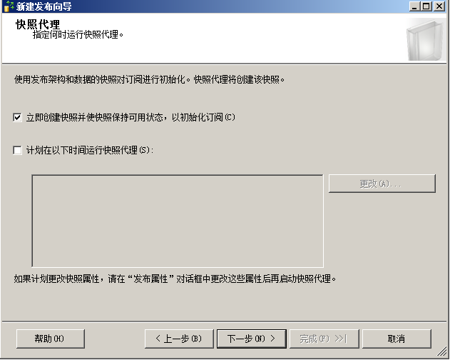

# 主服务器

防火墙开放1433端口

新建文件夹,设置局域网共享

启动sqlserver代理,并设置自启动

建个测试数据库

配置分发

一路下一步到快照文件夹

填写前面设置的共享目录

继续下一步直至完成

右键本地发布 新建发布

选事务发布,快照发布可能相当于全量备份还原,对等发布是多主复制,合并发布不明确

选取对象,这里只有表,正常还有别的内容,函数,存储过程什么的

可筛选

立即创建快照,正式环境还可以定时运行,节省服务器压力

设置账号密码

取个名

# 从服务器
防火墙开放1433端口,启动sqlserver代理,并设置自启动
本地订阅 右键 新建订阅,下一步

输入主服务器名称以及登录名密码,据说不能用IP

选第一个,第二个未跑通据说跟权限设置相关

新建订阅数据库

此处可定时获取,未尝试,目测问题不大

下一步,直到完成,而后可以查看同步状态

# 测试

